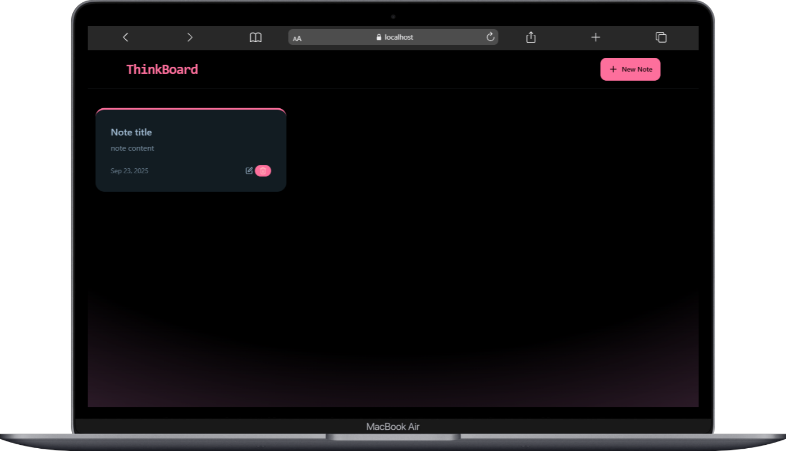
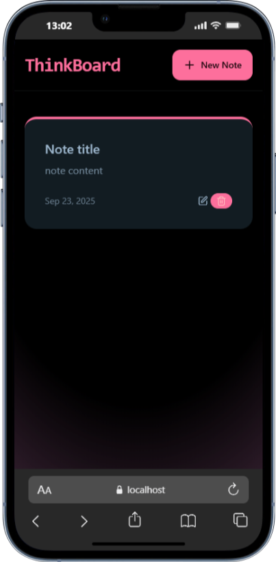
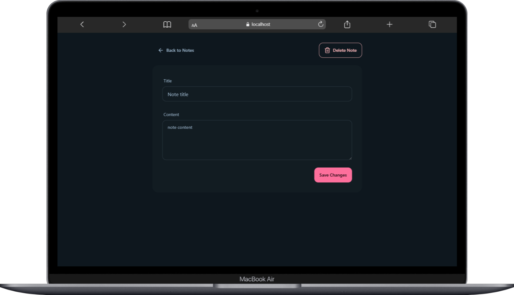
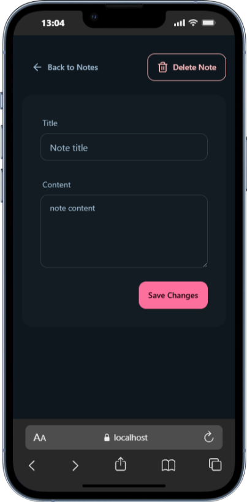

# ThinkBoard - MERN Stack Project

A full-stack MERN project I built to practice connecting React, Node, Express, and MongoDB.  
The goal was to see how frontend and backend work together and get hands-on experience with a full-stack app.

---

## Features
- Responsive React.js frontend
- Node.js + Express backend handling API requests
- MongoDB database for storing data
- Basic CRUD functionality
- Axios used for frontend-backend communication

---

## Tech Stack & Tools
- **MERN**: MongoDB, Express.js, React.js, Node.js
- **Tailwind CSS** for styling
- **Axios** for HTTP requests
- **Next Steps:** Implement authentication & role-based access (JWT/OAuth)

---

## Learning Goals
- Understand how frontend and backend interact
- Practice RESTful API design and database integration
- Learn state management in React
- Get comfortable structuring a full-stack project

---

## Challenges & How I Solved Them
- **Connecting frontend with backend:** Ran into CORS issues, fixed with Express middleware.  
- **State management:** Learned to lift state and pass props efficiently.  
- **CRUD with MongoDB:** Practiced schema design and database queries.

---

This project was inspired by freecodecamp (https://www.youtube.com/watch?v=F9gB5b4jgOI) which I followed to learn the basics.  
All code has been written by me, and I used it as a way to understand how a full-stack MERN app works.

## Screenshots

###  Home
<p align="center">
  
  &nbsp;
  
</p>

---

###  Note Card
<p align="center">
  
  &nbsp;
  
</p>

---

## How to Run Locally
1. Clone the repo:
```bash
git clone https://github.com/username/thinkboard.git

npm run build
